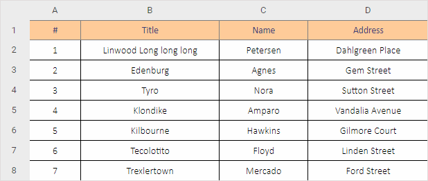

Excel2table 
-------------

[](https://badge.fury.io/js/excel2table) 

Excel2table is a library that will help you to render an Excel file as an HTML table. It uses https://github.com/dhtmlx/excel2json for Excel parsing.



### How to use

```js
import {render} from "excel2table";
render(html_container, data, config);
```
The parameters of the function are the following:

- **html_container** - a CSS locator or an HTML element
- **data** - a file object or a data blob
- **config** - optional, a configuration object { worker, scale }, where
	- *worker*: string - an URL for a web worker; CDN is used by default
	- *scale*: boolean - defines whether Excel scale is shown
	- *sheets*: boolean - defines if sheet selector need to be rendered or not


### License

MIT
